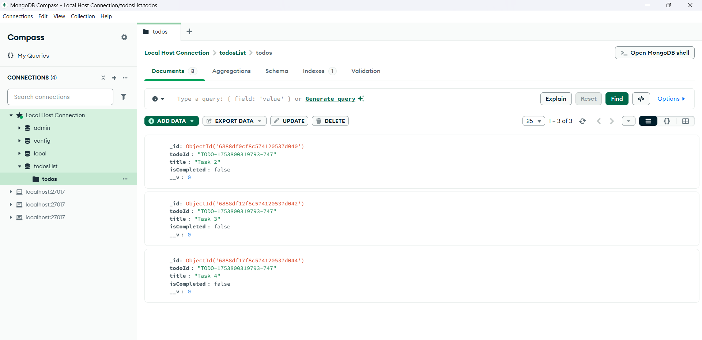

# TODO Web Server (MongoDB Integrated)

### It comprises of 3 types of requests:-

* POST - *Creates* the document in the collection
* GET - *Retrieves* the documents from the collection
* DELETE - *Deletes* a document as per the given id in params

### MongoDB Schema Verification

